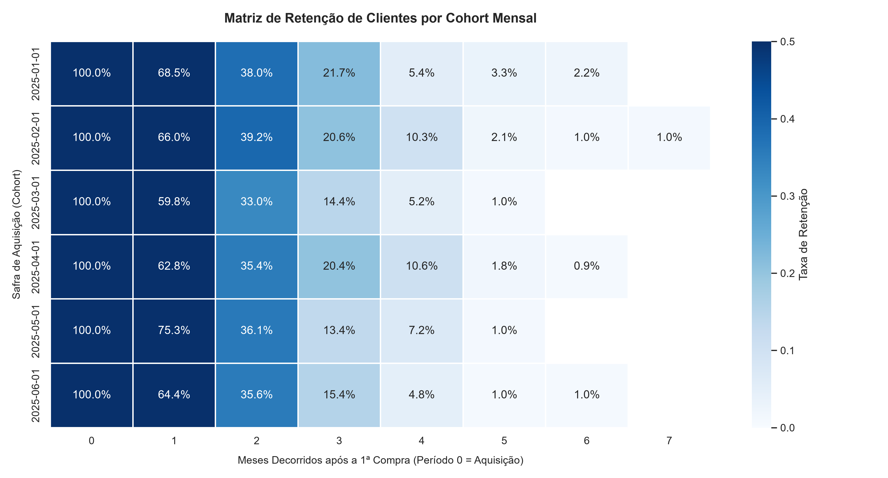

# 📊 Customer Cohort Retention Analysis (E-commerce / SaaS)

[](https://www.python.org/)
[](https://www.sqlite.org/)
[](https://pandas.pydata.org/)
[](https://opensource.org/licenses/MIT)

---

## 📌 Executive Summary (English)

This project delivers a modular, end-to-end data pipeline to compute and visualize **customer cohort retention rates** across monthly lifecycle stages. 

The dataset is driven by a **stochastic synthetic data generator** that models realistic behavioral patterns: initial onboarding, decaying repurchase curves, customer drop-off cliffs, and seasonal reactivation anomalies. While running the simulation generates unique transaction batches on each run, the **underlying statistical distributions and retention decay mechanics remain consistent**.

### 🎯 Business Questions Solved:
1. **Retention Decay Dynamics:** At what rate do freshly acquired customers churn between Month 0 and Month 3?
2. **Cohort Diagnostics:** How can marketing and product leaders distinguish genuine retention stickiness from short-term promotional rebuy spikes?
3. **Data-to-Action Translation:** What automated CRM and product plays counteract early and mid-stage lifecycle attrition?

---

## 🖼️ Retention Heatmap Matrix



> *Note: The chart above displays a representative run from the pipeline. Running `python src/generate_data.py` simulates dynamic transactional traffic, exhibiting similar underlying cohort behavior across executions.*

---

## 🔍 Core Analytical Patterns & Representative Case Study

Across simulation cycles, the pipeline models recurring behavioral traits observed in real-world subscription and transactional businesses:

### 1. The "Promo Spike & Secondary Churn Cliff" (e.g., May 2025 Cohort)
* **The Dynamic:** A cohort frequently registers an abnormally high Month 1 reactivation rate (~70%–75%), significantly outperforming peer cohorts (~60%–65%), only to experience an aggressive contraction by Month 2 and Month 3 (<15%).
* **Root-Cause Diagnostic:**
  * **Short-Term Incentive Bias:** Spikes of this profile typically reflect front-loaded discount campaigns (e.g., Mother's Day, clearance sales, or "30% off your next purchase within 30 days" vouchers).
  * **Incentive Exhaustion:** Repeat conversions driven strictly by price reductions fail to build organic retention. Once the incentive expires, the cohort suffers an accelerated churn cliff.
  * **Pantry Loading:** Aggressive initial bundles front-load customer inventory, suppressing demand for multiple subsequent billing cycles.

### 2. The Mid-Funnel Drop-Off (Month 2 to Month 4)
* **The Dynamic:** Most customer batches see steep attrition between Month 2 and Month 3 before plateauing below 5% around Month 4–5.
* **Diagnostic:** The primary point of permanent detachment occurs after the second purchase. If no post-purchase engagement loop occurs within 45 to 60 days, organic repurchase probability approaches zero.

---

## 🚀 Data-Driven Strategic Playbook

| Stage / Pattern | Observed Behavior | Recommended Strategic Action |
| :--- | :--- | :--- |
| **Month 0 $\rightarrow$ Month 1 Spike** | Artificial repurchase driven by one-time incentives | **Shift from Price to Value:** Replace direct cash coupons with tiered loyalty points or free add-ons on the second purchase to gauge true organic affinity. |
| **Month 1 $\rightarrow$ Month 3 Cliff** | Steep drop from peak engagement to churn | **Predictive Replenishment Flows:** Trigger automated emails or push notifications calibrated to product consumption lifecycles (typically 40–50 days after initial repurchases). |
| **Month 4+ (<5% Retention)** | Cohort reaches long-tail attrition plateau | **Win-Back Cadence:** Automate NPS diagnostics at day 60 and reserve high-margin reactivation incentives exclusively for dormant high-value customers at day 75. |

---

## 🛠️ Architecture & Technical Stack

```text
[Synthetic Generator] ──> [SQLite Database] ──> [Analytical SQL Query (CTEs)] ──> [Pandas Pipeline] ──> [Seaborn Heatmap]
   (Data Modeling)          (ACID Storage)       (Date Arithmetic & Windows)        (Matrix Normalization)     (High-Res Output)
```

* **Storage Engine:** SQLite (local relational database, zero external infrastructure overhead).
* **Data Transformation:** Pure SQL utilizing Common Table Expressions (CTEs) and date truncation functions.
* **Pipeline & Analytics:** Python (`pandas`, `numpy`) for matrix contingency pivoting and percentage normalization.
* **Visualization:** `seaborn` and `matplotlib` with formatted percentage annotations.

---

## 💻 How to Run Locally

### 1. Clone & Set Up Virtual Environment
```bash
git clone https://github.com/YOUR-USSER/cohort-retention-analysis.git
cd cohort-retention-analysis

# Create & activate environment
python -m venv venv

# Windows (PowerShell):
venv\Scripts\Activate.ps1
# Linux / macOS:
source venv/bin/activate

# Install dependencies
pip install -r requirements.txt
```

### 2. Generate Data & Run Analytical Pipeline
```bash
# Step A: Generate synthetic customer orders in SQLite
python src/generate_data.py

# Step B: Run the SQL extraction, calculate retention matrices, and render the chart
python src/analyze_retention.py
```
*The resulting visualization is exported directly to `output/cohort_retention_matrix.png`.*

---

# 🇧🇷 Versão em Português

## 📌 Visão Geral do Projeto

Este repositório apresenta um pipeline completo de engenharia analítica e análise de retenção por safras (**Cohort Analysis**). 

A base de dados é gerada por meio de uma **simulação estocástica (sintética)** que reproduz a dinâmica comportamental real de um e-commerce ou serviço por assinatura: curvas de declínio de recompra, pontos críticos de abandono (*churn cliffs*) e anomalias sazonais. Mesmo com variações naturais nos valores a cada execução da simulação, **a lógica de negócio e os padrões estatísticos subjacentes mantêm-se plenamente consistentes**.

---

## 💡 Análise de Cenário: O Fenômeno de "Pico Promocional e Queda Acelerada"

Em execuções típicas do pipeline (como observado na safra de **Maio/2025** no gráfico representativo):
* **Comportamento:** A safra apresenta um Mês 1 com recompra excepcional (~70% a 75%), superando as safras adjacentes, seguido de um colapso acentuado no Mês 2 (~36%) e Mês 3 (~13%), convergindo para a cauda longa residual (<2%).
* **Diagnóstico de Negócio:**
  1. **Recompra Viciada em Desconto:** Campanhas pontuais com cupons agressivos de segundo pedido geram volume transitório, mas não constroem retenção sustentável.
  2. **Efeito Despensa (*Pantry Loading*):** O consumidor aproveita a condição comercial temporária para antecipar compras futuras, cessando novos pedidos nos meses seguintes.
  3. **Janela Crítica de Ação:** O maior ponto de atrito ocorre entre o segundo pedido e o Mês 3. Sem réguas automatizadas de reposição baseadas no tempo médio de consumo, a base migra naturalmente para o abandono definitivo.

---

## 📂 Estrutura de Arquivos

```text
cohort-retention-analysis/
│
├── data/
│   └── database.sqlite             # Banco de dados gerado pela simulação
├── output/
│   └── cohort_retention_matrix.png # Matriz visual final (Heatmap)
├── src/
│   ├── generate_data.py            # Simulação probabilística de pedidos
│   ├── query.sql                   # Consulta SQL analítica (CTEs + Window Logic)
│   └── analyze_retention.py        # Pipeline de normalização e geração visual
├── requirements.txt                # Dependências do ecossistema Python
└── README.md                       # Documentação bilíngue e playbook de negócio
```

---

## 👤 Autor

Desenvolvido por **Kelvin**.
* **LinkedIn:** [linkedin.com/in/seu-perfil](https://www.linkedin.com/in/kelvin-rosa-670a8a19b/)
* **GitHub:** [github.com/seu-usuario](https://github.com/KelvinAlbert)